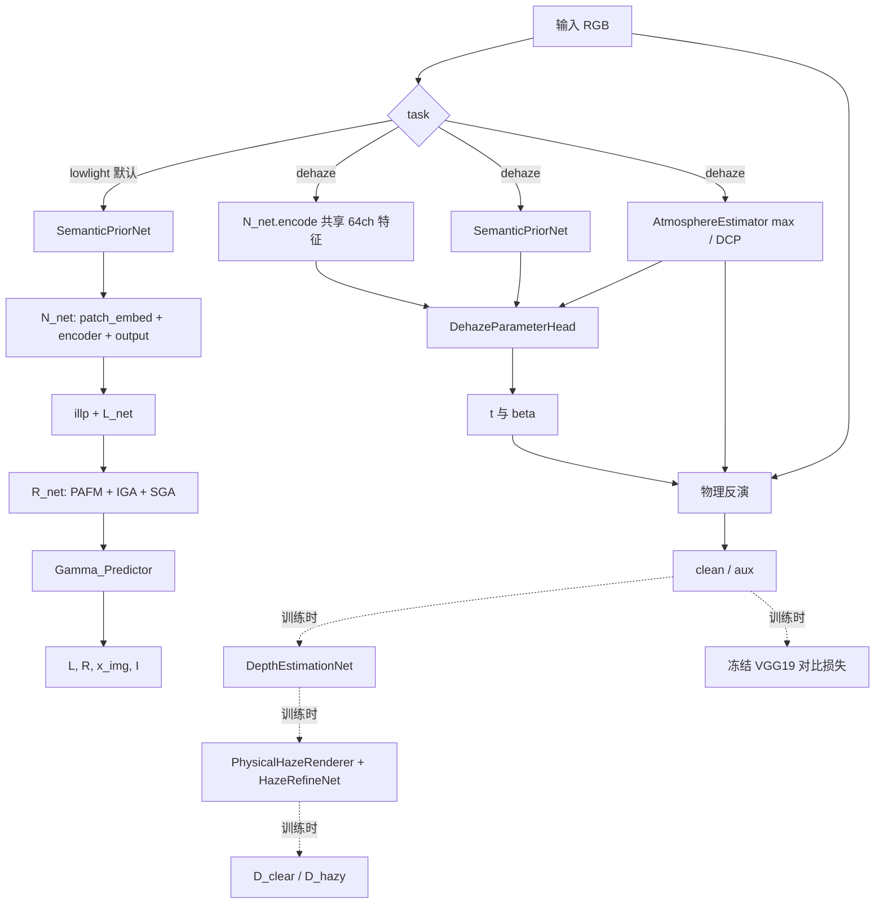

# SPS-Net 融合 D4+ 无配对去雾：改进设计

## 1. 目标与边界

本改造让同一个 SPS-Net 顶层模型显式支持低光增强和去雾：

```python
L, R, x_img, I = model(image)
L, R, x_img, I = model(image, task="lowlight")
clean = model(hazy, task="dehaze")
aux = model(hazy, task="dehaze", return_aux=True)
```

默认任务仍是 `lowlight`。原低光模块名、参数前缀、计算顺序和四元组返回值没有重命名。去雾训练只消费互相独立采样的清晰图和雾图，不使用 ITS 匹配 GT。

明确不在本版本加入 UR2P 颜色校准、夜间去雾、混合退化、自动任务分类器、扩散模型或可学习 `AirlightHead`。D4+ 的 EfficientNet-Lite3 也没有复制。

## 2. 原 SPS-Net 代码映射

重组后规范实现位于 `net/semantic.py`、`net/blocks.py`、`net/pafm.py`、`net/lowlight.py` 和 `net/model.py`；旧导入兼容文件已经移除。

| 代码 | 当前职责 | 本次处理 |
|---|---|---|
| `SemanticPriorNet` | 冻结 ViT-B/16，返回 `[原图语义, 768 通道深层特征]` | 默认返回格式不变；新增可回传到图像的全局 embedding 方法 |
| `N_net.patch_embed` | RGB 到 64 通道共享特征 | 参数名不变 |
| `N_net.encoder` | 两个 SPS TransformerBlock | 参数名不变；新增 `encode()` |
| `N_net.output` | 共享特征到初始恢复图 | 参数名不变；新增 `restore_initial()` |
| `Illumination_Estimator`，实例名 `illp` | 估计照明特征 | 低光专用，实例名保留 |
| `L_net` | 估计照明图 `L` | 低光专用，逻辑不变 |
| `R_net` | PAFM、IGA、两级 SGA 后估计 `R` | 低光专用，逻辑不变 |
| `Gamma_Predictor` | 预测全局 gamma | 低光专用，逻辑不变 |
| `PAFM` | 物理特征与共享特征跨通道/空间融合 | 新去雾头复用 |

原低光前向仍为：

```text
SemanticPriorNet
  -> N_net
  -> Illumination_Estimator
  -> L_net
  -> input / L
  -> R_net
  -> Gamma_Predictor
  -> I
```

`train_lowlight.py` 是 import-safe 的配对低光训练入口。上述低光更新由 `training/lowlight_trainer.py` 单一实现，继续执行 Neighboring Pixel Masking、Gamma 子图、`C_loss` 一致性、`R_loss` 重建、`P_loss` 先验、曝光、空间、TV、颜色、SASW、CLIP semantic/IQA 损失。

## 3. D4+ 机制映射

参考实现位于相邻目录 `/home/xhx/GY/model/D4_plus`：

| D4+ 代码/机制 | 本实现 |
|---|---|
| `HazeRemovalNet` 从多尺度特征预测 `t` 与全局 `beta` | `DehazeParameterHead` 使用 SPS 共享特征、Transformer、PAFM、SGA |
| `DepthEstimationNet` 从清晰图估计相对深度 | 独立轻量 `net/depth.py`，不使用预训练深度模型 |
| `HazeProduceNet` 物理粗加雾再学习细化 | `PhysicalHazeRenderer` + 残差幅度不超过 0.1 的 `HazeRefineNet` |
| 两域判别器、LSGAN | 两个训练专用 PatchGAN：`D_clear`、`D_hazy` |
| 两个 cycle、beta 伪监督、depth 伪监督 | 保留，并显式拆成三段更新 |
| VGG19 对比感知 | 保留五层权重和双方向比值 |
| 室外 DCP 空气光/伪 transmission | 参数零学习的 `AtmosphereEstimator(mode="dcp")` |
| `optimizer_depth.step()` 室内重复调用 | 修正为每 iteration 严格一次 |

相同之处是无配对双循环、显式密度/深度分解、双域 GAN、参数伪监督和双重对比感知。不同之处是特征骨干、细化残差边界、设备/数值安全、优化器所有权和部署边界；这些变化分别用于复用 SPS 表征、防止细化器绕过物理过程、支持小图测试并保护低光兼容性。

## 4. 最终架构



实线模块参与对应任务推理；虚线模块仅用于训练。去雾推理不会构造 DepthNet、HazeRefineNet、判别器或 VGG19。

## 5. 物理模型

低光分支保持原 Retinex/gamma 形式：

\[
R \approx X/L,\qquad I=L^{\alpha}R.
\]

去雾采用：

\[
H=Jt+A(1-t),\qquad J=\mathrm{clip}((H-A)/(t+\epsilon)+A,0,1)
\]

\[
t=e^{-\beta d},\qquad d=\log(\max(t,\epsilon))/(-\max(\beta,\epsilon)).
\]

`t` 经 sigmoid 映射后限制在配置的 `[0.05, 0.95]`，`beta` 经 sigmoid 映射到室内 `[0.6,1.8]` 或室外 `[0.010,0.035]`。室内空气光为每图最大 RGB，室外空气光由 DCP 的最亮 dark-channel 候选估计；二者均无可学习参数。

## 6. DehazeParameterHead

默认结构为：

1. `A` 扩展为全分辨率，与雾图拼成 6 通道物理输入。
2. `OverlapPatchEmbed(6,64)` 生成物理特征。
3. SPS `N_net.encode` 的 64 通道特征与物理特征经 `PAFM(64)` 融合。
4. Stage 0：64 通道、原分辨率、Transformer，并用 3 通道原图语义做 SGA。
5. Stage 1：96 通道、1/2 分辨率、Transformer。
6. Stage 2：128 通道、1/4 分辨率、Transformer，并用 768 通道 CLIP 深层特征做 SGA。
7. transmission decoder 双线性上采样，依次拼接 Stage 1、Stage 0 skip，恢复原分辨率并输出单通道 `t`。
8. 三个 stage 的 GAP 特征拼接，经两层 1x1 head 输出 `[B,1,1,1]` 的 `beta`。

通道、block 数、head 数、物理范围、空气光模式、语义开关都可由 YAML 配置。默认拓扑满足 64/96/128 要求；小型测试可缩小通道而不改变接口。

## 7. 训练辅助模块

- `DepthEstimationNet`：三层轻量编码器、skip decoder，sigmoid 后线性映射到配置深度范围。
- `PhysicalHazeRenderer`：只执行 `t=exp(-beta*depth)` 和物理合成。
- `HazeRefineNet`：输入 `clean/coarse/t`，输出
  \[
  \hat H=\mathrm{clip}(H_{coarse}+0.1\tanh(r),0,1),
  \]
  因此学习残差无法绕过物理粗结果。
- `D_clear`、`D_hazy`：输出无 sigmoid 的 patch score，直接用于 LSGAN。
- `VGG19FeatureExtractor`：仅由训练 runtime 在对比权重大于零时构造，始终冻结和 eval。

## 8. 损失

Cycle：

\[
L_{cycle}=\lVert C-\hat C\rVert_1+\lVert H-\hat H\rVert_1.
\]

LSGAN 生成器项是两域 fake score 到 1 的均方误差均值；每个判别器使用 real 到 1、detached fake 到 0 的均方误差。

Scattering：

\[
L_{scatt}=\lVert\hat\beta_C-\beta_C\rVert_2^2/(\beta_{max}-\beta_{min}).
\]

DepthNet 单独更新：

\[
L_{depth}=\lVert G_E(\hat C)-\mathrm{stopgrad}(d_{pseudo})\rVert_1/(d_{max}-d_{min}).
\]

室内 `d_pseudo=log(t_H)/(-beta_H)`；室外由 DCP transmission 得到。该项只更新 DepthNet，不计入生成器总损失。

双重对比感知：

\[
L_{dc}=\sum_j w_j\left[
\frac{\lVert\phi_j(\hat C)-\phi_j(C_{ref})\rVert_1}
{\lVert\phi_j(\hat C)-\phi_j(H_{ref})\rVert_1+\epsilon}
+
\frac{\lVert\phi_j(\hat H)-\phi_j(H_{ref})\rVert_1}
{\lVert\phi_j(\hat H)-\phi_j(C_{ref})\rVert_1+\epsilon}
\right]
\]

其中 `w=[0,0.4,0.6,0,1.0]`。

语义一致性复用 `SemanticPriorNet` 已加载的 ViT-B/16：

\[
L_{sem}=1-\cos(F_{CLIP}(H),F_{CLIP}(\hat C)).
\]

生成器总损失：

\[
L_G=1.0L_{cycle}+0.2L_{gan}+1.0L_{scatt}+10^{-4}L_{dc}+0.05L_{sem}.
\]

Stage 4 额外使用冻结原 SPS 教师：

\[
L_{retain}=0.1\lVert I_{student}-I_{teacher}\rVert_1.
\]

## 9. 模块边界

| 类别 | 模块 |
|---|---|
| 共享 | `SemanticPriorNet`、`N_net.patch_embed`、`N_net.encoder` |
| 低光专用 | `N_net.output`、`illp`、`L_net`、`R_net`、`Gamma_Predictor` |
| 去雾部署 | `AtmosphereEstimator`、`DehazeParameterHead` |
| 仅训练 | `DepthEstimationNet`、`PhysicalHazeRenderer`、`HazeRefineNet`、`D_clear`、`D_hazy`、VGG19 losses |

## 10. Checkpoint 兼容

- 原属性前缀 `N_net.patch_embed/encoder/output`、`L_net`、`R_net`、`illp`、`Gamma_Predictor`、`sem_net` 均保留。
- 旧 SPS state dict 使用 `strict=False` 加载，并打印 missing/unexpected keys；missing 应主要是新增 `dehaze_head`。
- 完整训练 checkpoint 保存 SPS 模型（排除 `sem_net.*` 冻结 CLIP 权重）、DepthNet、RefineNet、两个判别器、所有 optimizer/scheduler、stage、iteration、epoch 和完整 config。
- `--resume` 只用于同一 stage 的精确续训；`--init-checkpoint` 用于 Stage 间迁移所有模块权重并建立新 optimizer，避免不同参数组状态不匹配。

## 11. 风险与缓解

| 风险 | 监控 | 缓解 |
|---|---|---|
| transmission 塌到上下界 | `t_mean/std/low_ratio/high_ratio` | 范围映射、cycle、物理重建、必要时降低 GAN 权重 |
| beta 塌缩 | `beta_mean/std`、scattering | 随机 beta 伪监督、分域物理范围 |
| depth 塌缩 | `depth_mean/std`、depth loss | 独立 optimizer、detach 伪目标、室外 DCP 伪深度 |
| GAN 纹理/色偏伪影 | 两域 GAN、样图 | 生成器权重仅 0.2、梯度裁剪、受限 RefineNet；不增加颜色校准 |
| 天空 halo | 室外 mask、边界样图 | clear 域判别和 cycle 屏蔽天空，mask nearest 变换，DCP 范围约束 |
| 低光遗忘 | Stage 0 回归、teacher retain、低光指标 | 小 shared LR、Stage 1/2/3 冻结策略、Stage 4 任务比例可调到 2:1 |

## 12. 文件改动

- 模型按职责拆分为 `net/blocks.py`、`net/pafm.py`、`net/semantic.py`、`net/lowlight.py`、`net/model.py`，并新增 `net/dehaze.py`、`net/depth.py`、`net/rehaze.py`、`net/discriminator.py`。
- 数据按职责拆分为 `datasets/lowlight.py`、`datasets/dehaze.py`、`datasets/loaders.py`；真实图与 mask 的 basename/尺寸校验集中在 `datasets/dehaze.py`，并由 `scripts/validate_real_dataset.py` 提供预检入口。
- 损失拆分为 `loss/lowlight_loss.py`、`loss/sasw_loss.py`、`loss/lowlight_clip.py`、`loss/dehaze_loss.py`。
- 训练基础设施包含 `training/lowlight_sampling.py`、`training/lowlight_trainer.py`、`training/dehaze_trainer.py`、`training/runtime.py`。
- 规范入口为 `train_lowlight.py`、`train_lowlight_unpaired.py`、`eval_lowlight.py`、`train_dehaze.py`、`train_joint.py`、`eval_dehaze.py`；不再保留重复的命令转发脚本。
- 模型、数据、损失和采样均直接使用上述 package 规范路径，不再保留根目录导入兼容层。
- 新增配置：`configs/dehaze_its.yaml`、`configs/dehaze_real.yaml`、`configs/joint.yaml`。
- 测试：提示词要求的五个测试文件，加 `tests/test_organization.py` 组织回归。
- 文档：本文件、`docs/TRAINING_PIPELINE.md`、`docs/SOURCE_MODULES.md` 和 `docs/scripts/` 下逐脚本文档。

完整逐文件职责见 [`SOURCE_MODULES.md`](SOURCE_MODULES.md)。

## 13. 消融实验

建议保持相同无配对数据划分、iteration 和随机种子，逐项比较：

1. 仅 Stage 0 SPS 特征 vs 64/96/128 多尺度。
2. 去掉 PAFM，改为相加或拼接。
3. 去掉原图 SGA、去掉深层 CLIP SGA、两者都去掉。
4. 固定 beta vs 多尺度 GAP beta head。
5. 纯物理 renderer vs 加受限 RefineNet。
6. 无 GAN、无 scattering、无 depth、无 dual contrast、无 semantic。
7. 室外 max 空气光 vs DCP 空气光。
8. Stage 4 无 retain、`lambda_retain=0.1`，以及 lowlight:dehaze 为 1:1/2:1。

除 PSNR/SSIM/LPIPS/无参考指标外，必须同时报告 `t/beta/depth` 分布、天空边缘失败案例和低光 Stage 0 相对退化，避免只用单一图像质量指标判断物理分解是否稳定。
